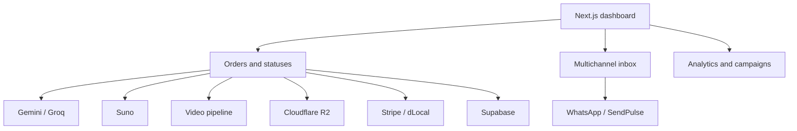

# Escribe Tu Canción — Operations Dashboard

The dashboard turns a paid order into a traceable operation. It generates lyrics and songs, manages conversations, coordinates files, processes add-ons, and shows what is happening across the business.

It is the operational core of a three-part platform: it receives orders from the landing experience and shares context and actions with the conversational agent.

**Development approach:** Built entirely with AI, with human direction and validation.

## At a glance

| Metric | Value |
| --- | ---: |
| API routes | 58 |
| React components | 82 |
| Core operational views | 6 |
| Test files | 4 |

## From admin panel to operating system

The hard part is not displaying a table. It is coordinating providers with different response times, formats, and failure modes while preserving the state of every order.



## Core capabilities

- **Production:** Generate, edit, and replace lyric sections; create and track songs and videos.
- **Operations:** Manage order statuses, deliveries, add-ons, payments, and scheduled tasks.
- **Customer support:** Handle conversations, templates, media, and order actions from a shared inbox.
- **Distribution:** Send songs, videos, links, and reminders through WhatsApp.
- **File management:** Upload assets through presigned URLs and store them in Cloudflare R2.
- **Business visibility:** Review revenue, performance metrics, TikTok campaigns, and profitability.

## Relevance to job management

The dashboard addresses the same central challenge as a field service system: providing one source of truth for incoming work, ownership, status, customer communication, and payment.

Music orders map to operational jobs. Production stages map to service statuses. Add-ons and files map to materials and evidence. The conversation inbox keeps customer context beside the job instead of isolating it in another tool.

## Domain-oriented design

API routes are grouped by intent—orders, payments, audio, video, WhatsApp, inbox, campaigns, and storage. This structure makes an end-to-end flow easier to trace without concentrating every concern in one service.

The frontend follows the same principle. Operational components, analytics modules, and the inbox reuse shared types and services instead of duplicating provider access.

## Stack

| Area | Technology |
| --- | --- |
| Application | Next.js, React, and TypeScript |
| Data | Supabase |
| AI | Vercel AI SDK, Gemini, and Groq |
| Music and video | Generation APIs and webhooks |
| Payments | Stripe and dLocal |
| Messaging | WhatsApp and SendPulse |
| Files | Cloudflare R2 / S3 SDK |
| Quality | Vitest, Testing Library, fast-check, and Playwright |

## Technical topics worth discussing

1. Representing long-running asynchronous processes in the UI.
2. Designing webhooks for providers with different contracts.
3. Preventing an external integration from leaking across every domain.
4. Testing critical utilities such as phone normalization and profitability calculations.
5. Reviewing 58 AI-generated routes while preserving consistency.

## Local setup

```bash
pnpm install
cp .env.example .env.local
pnpm dev
```

```bash
pnpm test
pnpm build
```

`.env.example` contains placeholder names and demo values only. No tokens or private endpoints are included.
